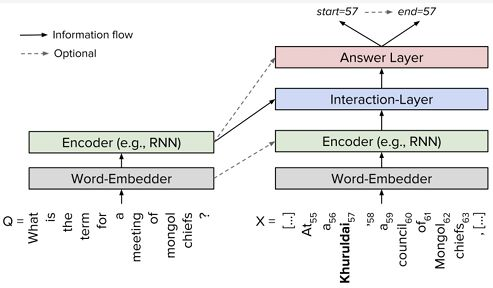

# 阅读理解模型

阅读理解的基本结构如下

1) embed, 词向量
2) encoder, 对问题和文章进行建模
3) interaction_layer， 各种attention机制花式结合问题和文章进行交互，在原文中得到query  aware 的文章表示  
4) answer layer， 用query-aware的文章表示来预测答案，一般用两个网络分别预测答案的起始位置和终止位置

## 实验

| 方法 | precision | recall | f1-score | em | rouge-l | bleu |
| --- | --- | --- | --- | --- | --- | --- |

【1】 https://zhuanlan.zhihu.com/p/268712912
